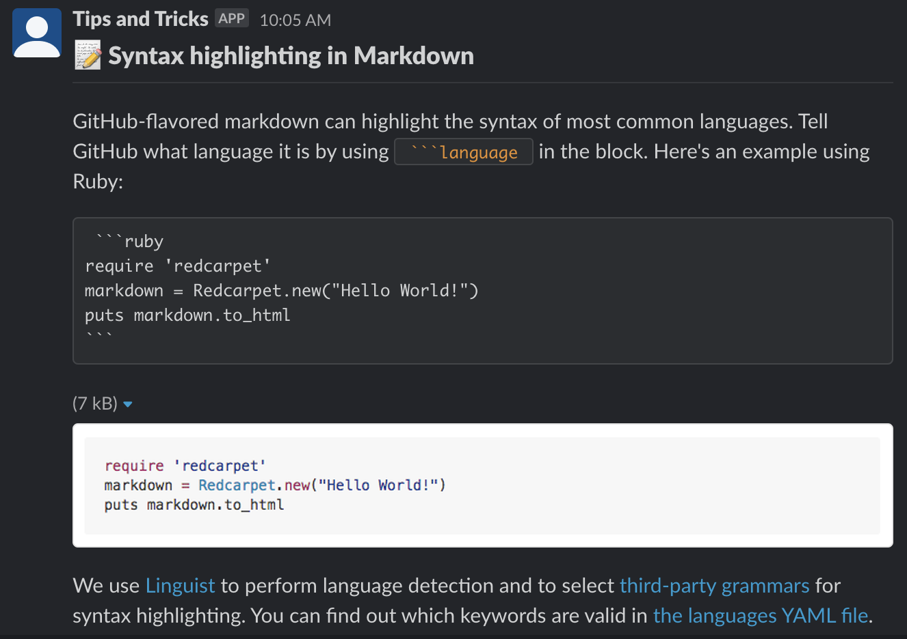

# GitHub Tips Action

This Action posts a GitHub tip into a Slack channel.  It works by picking a random tip from the [tips](tips.json) file, then posts it to Slack using the [Slack API](https://api.slack.com/incoming-webhooks).  Here's what it looks like!

:information_source: Each entry uses Slack's [Block kit API](https://api.slack.com/block-kit) for formatting.  You can get started with the [Block kit builder](https://app.slack.com/block-kit-builder) for an easy way to create more content.

## Getting Started

Take a look at the [test workflow](.github/workflows/test.yml) to see how to use this Action.  Fork this repository in GitHub.com and add your Slack channel ID and bot token as secrets for the workflow to use (or create a private repo and copy this all in, your choice!)

If you'd like your own custom content, edit the `tips.json` file.  Send a pull request back to help us improve the content. :heart:
